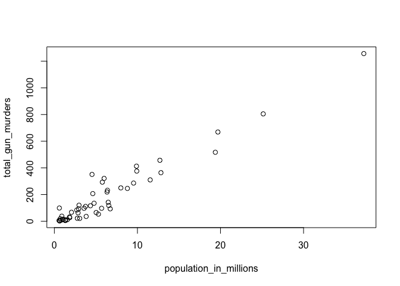
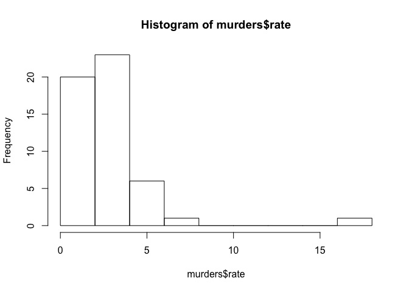
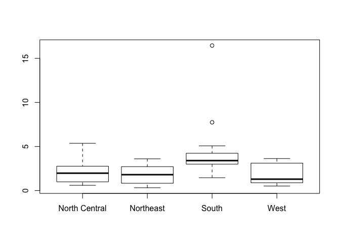

Analysis of murders dataset
---------------------------

Dataset was provided as part of the edX course HarvardX PH125.1x: Data Science: R Basics </BR> The coursework was originally done through DataCamp. </BR> Redid the work using R Studio as a practice exercise.

### Load in dataset

``` r
library(tidyverse)
```

    ## ── Attaching packages ───────────────────────────────────────────────────────────── tidyverse 1.2.1 ──

    ## ✔ ggplot2 3.1.0       ✔ purrr   0.3.0  
    ## ✔ tibble  2.0.1       ✔ dplyr   0.8.0.1
    ## ✔ tidyr   0.8.2       ✔ stringr 1.4.0  
    ## ✔ readr   1.3.1       ✔ forcats 0.4.0

    ## ── Conflicts ──────────────────────────────────────────────────────────────── tidyverse_conflicts() ──
    ## ✖ dplyr::filter() masks stats::filter()
    ## ✖ dplyr::lag()    masks stats::lag()

``` r
murders <- read_csv("./data/murders.csv")
```

    ## Parsed with column specification:
    ## cols(
    ##   state = col_character(),
    ##   abb = col_character(),
    ##   region = col_character(),
    ##   population = col_double(),
    ##   total = col_double()
    ## )

``` r
names(murders)
```

    ## [1] "state"      "abb"        "region"     "population" "total"

Look at dataset content

``` r
str(murders)
```

    ## Classes 'spec_tbl_df', 'tbl_df', 'tbl' and 'data.frame': 51 obs. of  5 variables:
    ##  $ state     : chr  "Alabama" "Alaska" "Arizona" "Arkansas" ...
    ##  $ abb       : chr  "AL" "AK" "AZ" "AR" ...
    ##  $ region    : chr  "South" "West" "West" "South" ...
    ##  $ population: num  4779736 710231 6392017 2915918 37253956 ...
    ##  $ total     : num  135 19 232 93 1257 ...
    ##  - attr(*, "spec")=
    ##   .. cols(
    ##   ..   state = col_character(),
    ##   ..   abb = col_character(),
    ##   ..   region = col_character(),
    ##   ..   population = col_double(),
    ##   ..   total = col_double()
    ##   .. )

Look at first 6 records

``` r
head(murders)
```

    ## # A tibble: 6 x 5
    ##   state      abb   region population total
    ##   <chr>      <chr> <chr>       <dbl> <dbl>
    ## 1 Alabama    AL    South     4779736   135
    ## 2 Alaska     AK    West       710231    19
    ## 3 Arizona    AZ    West      6392017   232
    ## 4 Arkansas   AR    South     2915918    93
    ## 5 California CA    West     37253956  1257
    ## 6 Colorado   CO    West      5029196    65

Find the state with the lowest total number of murders

``` r
murders$state[which.min(murders$total)]
```

    ## [1] "Vermont"

Find the state with the highest total number of murders

``` r
murders$state[which.max(murders$total)]
```

    ## [1] "California"

Create a vector for the state names </BR> Order the states by population

``` r
states <- murders$state
ranks <- rank(murders$population)
index <- order(murders$population)
states_in_order <- data.frame( state_name = states[index],
                               state_rank = ranks[index])
states_in_order
```

    ##              state_name state_rank
    ## 1               Wyoming          1
    ## 2  District of Columbia          2
    ## 3               Vermont          3
    ## 4          North Dakota          4
    ## 5                Alaska          5
    ## 6          South Dakota          6
    ## 7              Delaware          7
    ## 8               Montana          8
    ## 9          Rhode Island          9
    ## 10        New Hampshire         10
    ## 11                Maine         11
    ## 12               Hawaii         12
    ## 13                Idaho         13
    ## 14             Nebraska         14
    ## 15        West Virginia         15
    ## 16           New Mexico         16
    ## 17               Nevada         17
    ## 18                 Utah         18
    ## 19               Kansas         19
    ## 20             Arkansas         20
    ## 21          Mississippi         21
    ## 22                 Iowa         22
    ## 23          Connecticut         23
    ## 24             Oklahoma         24
    ## 25               Oregon         25
    ## 26             Kentucky         26
    ## 27            Louisiana         27
    ## 28       South Carolina         28
    ## 29              Alabama         29
    ## 30             Colorado         30
    ## 31            Minnesota         31
    ## 32            Wisconsin         32
    ## 33             Maryland         33
    ## 34             Missouri         34
    ## 35            Tennessee         35
    ## 36              Arizona         36
    ## 37              Indiana         37
    ## 38        Massachusetts         38
    ## 39           Washington         39
    ## 40             Virginia         40
    ## 41           New Jersey         41
    ## 42       North Carolina         42
    ## 43             Michigan         43
    ## 44              Georgia         44
    ## 45                 Ohio         45
    ## 46         Pennsylvania         46
    ## 47             Illinois         47
    ## 48             New York         48
    ## 49              Florida         49
    ## 50                Texas         50
    ## 51           California         51

Calculate the murder rate per capita </BR> Order the states by descending murder rate

``` r
murder_rate <- murders$total / murders$population * 100000
murders$state[ order(murder_rate, decreasing = TRUE)]
```

    ##  [1] "District of Columbia" "Louisiana"            "Missouri"            
    ##  [4] "Maryland"             "South Carolina"       "Delaware"            
    ##  [7] "Michigan"             "Mississippi"          "Georgia"             
    ## [10] "Arizona"              "Pennsylvania"         "Tennessee"           
    ## [13] "Florida"              "California"           "New Mexico"          
    ## [16] "Texas"                "Arkansas"             "Virginia"            
    ## [19] "Nevada"               "North Carolina"       "Oklahoma"            
    ## [22] "Illinois"             "Alabama"              "New Jersey"          
    ## [25] "Connecticut"          "Ohio"                 "Alaska"              
    ## [28] "Kentucky"             "New York"             "Kansas"              
    ## [31] "Indiana"              "Massachusetts"        "Nebraska"            
    ## [34] "Wisconsin"            "Rhode Island"         "West Virginia"       
    ## [37] "Washington"           "Colorado"             "Montana"             
    ## [40] "Minnesota"            "South Dakota"         "Oregon"              
    ## [43] "Wyoming"              "Maine"                "Utah"                
    ## [46] "Idaho"                "Iowa"                 "North Dakota"        
    ## [49] "Hawaii"               "New Hampshire"        "Vermont"

We want to find the states where the murder rate is less than 0.71

``` r
sum(murder_rate < 0.71)
```

    ## [1] 5

``` r
murders$state[murder_rate < 0.71]
```

    ## [1] "Hawaii"        "Iowa"          "New Hampshire" "North Dakota" 
    ## [5] "Vermont"

Find states that meet two conditions: Region = West and murder rate is less than 1

``` r
west <- murders$region == "West"
safe <- murder_rate <=1
index <- safe & west
murders$state[index]
```

    ## [1] "Hawaii"  "Idaho"   "Oregon"  "Utah"    "Wyoming"

Find the murder rate for Massachusetts

``` r
murder_rate[which(murders$state == "Massachusetts")]
```

    ## [1] 1.802179

dplyr package
-------------

Install the dplyr package

``` r
library(dplyr)
```

Add a new column to the table, for the murder rate per capita

``` r
murders <- mutate(murders, rate = total / population * 100000)
head(murders)
```

    ## # A tibble: 6 x 6
    ##   state      abb   region population total  rate
    ##   <chr>      <chr> <chr>       <dbl> <dbl> <dbl>
    ## 1 Alabama    AL    South     4779736   135  2.82
    ## 2 Alaska     AK    West       710231    19  2.68
    ## 3 Arizona    AZ    West      6392017   232  3.63
    ## 4 Arkansas   AR    South     2915918    93  3.19
    ## 5 California CA    West     37253956  1257  3.37
    ## 6 Colorado   CO    West      5029196    65  1.29

Display the 5 states with a murder rate less than 0.71

``` r
filter(murders, rate < 0.71)
```

    ## # A tibble: 5 x 6
    ##   state         abb   region        population total  rate
    ##   <chr>         <chr> <chr>              <dbl> <dbl> <dbl>
    ## 1 Hawaii        HI    West             1360301     7 0.515
    ## 2 Iowa          IA    North Central    3046355    21 0.689
    ## 3 New Hampshire NH    Northeast        1316470     5 0.380
    ## 4 North Dakota  ND    North Central     672591     4 0.595
    ## 5 Vermont       VT    Northeast         625741     2 0.320

Display only 3 columns for the 5 states with the lowest rate

``` r
murders %>% select(state, region, rate) %>% filter( rate < 0.71 )
```

    ## # A tibble: 5 x 3
    ##   state         region         rate
    ##   <chr>         <chr>         <dbl>
    ## 1 Hawaii        West          0.515
    ## 2 Iowa          North Central 0.689
    ## 3 New Hampshire Northeast     0.380
    ## 4 North Dakota  North Central 0.595
    ## 5 Vermont       Northeast     0.320

Create a scatterplot of population in millions & total murders

``` r
population_in_millions <- murders$population / 1000000
total_gun_murders <- murders$total
plot(population_in_millions, total_gun_murders)
```

 </BR> The graph shows that there is a relationship between population and number of murders </BR>

Create a histogram for the murder rate

``` r
hist(murders$rate)
```

 </BR> There is one very high anomaly

``` r
murders$state[which.max(murders$rate)]
```

    ## [1] "District of Columbia"

Create a boxplot

``` r
boxplot(rate~region, data = murders)
```

 </BR> The region South has the highest murder rate </BR>
